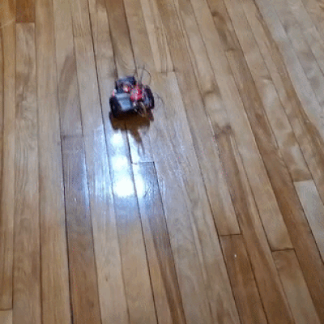

  

  <h1>Mini Course Program 2026:</h1> 

  
<strong> RoboLink: Build and Drive Your Smartphone-Controlled Robot</strong>

  
Carleton University Mini Course Program

  
Instructors: Dr. Mahmoud Sayed and Mahmoud Yassin

  

    <a href="https://carleton.ca/mcp/">Carleton MCP</a> |
    <a href="https://minic.ca/">Mini-Courses</a>
  

  

## Course Folder Guide

This repository is the student-facing course pack for RoboLink. The course moves from basic electronics to a working robot that can be driven from an Android phone. Each day folder has its own README with the day introduction, learning goals, exact contents, and suggested order.

| Folder | Students Work On |
| --- | --- |
| [`Day0_Orientation/`](Day0_Orientation/) | Course welcome, schedule, group work, and the project roadmap. |
| [`Day1_Getting_Started/`](Day1_Getting_Started/) | Circuits, voltage, current, LEDs, switches, and safe wiring habits. |
| [`Day2_Arduino_Basics/`](Day2_Arduino_Basics/) | Arduino IDE setup, Blink, button input, LEDs, buzzer, and first sketches. |
| [`Day3_Sensors/`](Day3_Sensors/) | IR object detection, ultrasonic distance sensing, and Serial Monitor readings. |
| [`Day4_Serial_Monitor_Robot/`](Day4_Serial_Monitor_Robot/) | DC motors, L9110 driver control, and Serial Monitor robot commands. |
| [`Day5_RoboLink_Smartphone_Control/`](Day5_RoboLink_Smartphone_Control/) | BLE communication, Android app setup, wireless commands, and final robot driving. |

## Course Snapshot

RoboLink is a five-day robotics mini course for students who are starting with electronics, embedded programming, sensors, motors, and wireless control. The orientation material gives the classroom context, while the folders above are the working materials students use during the course.

By the end of the course, students should be able to:

- Build and test simple breadboard circuits safely.
- Use the Arduino IDE with an Arduino Nano ATmega168.
- Read and modify Arduino sketches.
- Use buttons, IR sensors, ultrasonic sensors, LEDs, buzzers, motors, and the Serial Monitor.
- Control a two-motor robot with an L9110 motor driver.
- Send commands from an Android phone to the robot using a BLE module.
- Troubleshoot wiring, power, code, and communication problems.

## Software

- Arduino IDE
- WaveForms from Digilent
- Android phone for the RoboLink smartphone control app on Day 5

## Main Hardware

- Arduino Nano ATmega168
- Analog Discovery 2 from Digilent
- Breadboard and jumper wires
- LEDs and resistors
- Push button
- Buzzer module
- IR obstacle sensor
- Ultrasonic sensor
- L9110 motor driver
- DC motors and robot chassis
- BLE HC-05-style module used for RoboLink wireless control

## Suggested Use

1. Start with [`Day0_Orientation/`](Day0_Orientation/).
2. Work through each day folder in order.
3. Open the day README before opening the lesson or lab files.
4. Open the matching Arduino `.ino` file in the Arduino IDE when a lab asks for code.
5. Ask your instructor to check wiring before connecting power.

## Survey

The end-of-course survey link is open. Please take a few minutes to complete the feedback form:

[Complete the RoboLink survey](https://forms.gle/tiZQJAAHRRJ7FY2aA)
